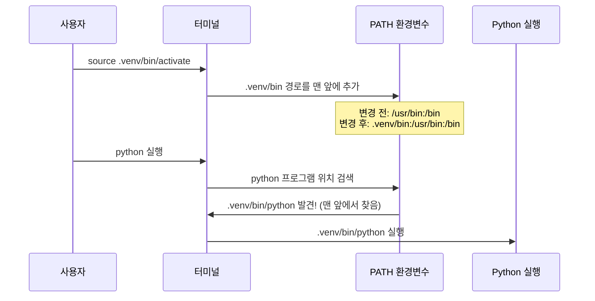

### Python Type Hints

타입 힌트란 blood type이라고 한다. 

파이썬에서 타입은 데이터의 종류이다. 타입 힌트는 이 변수가 어떤 종류인지 단서를 남기는 것이다.

```python
# 타입 힌트 없음
name = "jeff"

# 타입 힌트 있음
name: str = "jeff"
```

`name: str` 은 “name은 문자열이야”라고 표시한 것이다. 파이썬은 힌트를 강제하지 않으며 실행할 때 다른 타입을 넣어도 에러가 나지 않는다. 

### 가상환경설정 및 FastAPI 설치

### 1단계: 프로젝트 디렉토리 생성

```bash
# 1. 홈 디렉토리로 이동
cd ~

# 2. 코드 프로젝트들을 모아둘 디렉토리 생성
mkdir code

# 3. code 디렉토리로 이동
cd code

# 4. 새 프로젝트 디렉토리 생성
mkdir awesome-project

# 5. 프로젝트 디렉토리로 이동
cd awesome-project
```

**2단계: 가상 환경 생성**

```bash
# Python의 venv 모듈을 사용하여 .venv 디렉토리에 가상 환경 생성
python -m venv .venv

# 명령어 해석:
# python     : python 프로그램 실행
# -m         : 모듈을 스크립트로 실행하겠다는 옵션
# venv       : 가상 환경을 만드는 내장 모듈 이름
# .venv      : 생성할 가상 환경 디렉토리 이름 (관례적으로 .venv 사용)
```

**3단계: 가상 환경 활성화/비활성화**

```bash
# Linux/macOS 예시
source .venv/bin/activate

# 명령어 해석
# source     : 스크립트 파일을 현재 셸에서 실행
# .venv/bin/activate : 가상 환경을 활성화하는 스크립트 파일 경로

# 가상 환경 비활성화
deactivate
```

**4단계: 가상 환경 활성화 확인(선택사항)**

```bash
# Linux/macOS에서 확인
which python
# 출력 예시: /home/jeff/code/awesome-project/.venv/bin/python
#																						↑ 프로젝트 내부의 .venv 경로가 표시되면 성공!
```

**가상 환경 활성화의 원리**



### 패키지 설치

**pip 업그레이드**

```bash
# pip를 최신 버전으로 업그레이드
python -m pip install --upgrade pip

# 명령어 해석:
# python -m pip    : pip 모듈을 Python으로 실행
# install          : 패키지 설치 명령
# --upgrade        : 이미 설치된 패키지를 최신 버전으로 업그레이드
# pip              : 업그레이드할 패키지 이름 (pip 자기 자신)
```

**패키지 직접 설치**

```bash
# pip 사용
pip install "fastapi[standard]"

# uv 사용 (더 빠름)
uv pip install "fastapi[standard]"

# [standard]는 FastAPI의 표준 의존성 패키지들을 함께 설치하는 옵션입니다
```

**requirements.txt로 설치**

```bash
# requirements.txt 파일에 정의된 모든 패키지를 설치
pip install -r requirements.txt

# 명령어 해석:
# -r               : requirements 파일에서 읽어오겠다는 옵션
# requirements.txt : 패키지 목록이 담긴 파일 이름
```

**pip freeze > requirements.txt**

<aside>
💡

requirements.txt 파일 만드는 명령어 (버전 포함)
ex) 팀장이 이 명령어로 설치하고 나머지 팀원은 pip install -r requirements.txt 로 설치하여 버전을 맞추는 느낌으로 진행

</aside>

### .gitignore 설정

```bash
# .venv 디렉토리 안에 .gitignore 파일 생성
echo "*" > .venv/.gitignore

# 명령어 해석:
# echo "*"         : "*" 문자열을 출력 (* 는 Git에서 "모든 것"을 의미)
# >                : 출력을 파일로 리다이렉트
# .venv/.gitignore : 생성할 파일 경로
```

**프로그램 실행**

```bash
# 가상 환경이 활성화된 상태에서 프로그램 실행
python [main.py](http://main.py)
```

**AI 활용 방법**

REST API 문서 → OpenAPI json → FastAPI 엔드포인트로 만들어줘

### PATH Parameter

```python
from fastapi import FastAPI

app = FastAPI()

# {item_id}가 Path Parameter입니다
# URL 경로의 중괄호 안에 변수 이름을 작성합니다
@app.get("/items/{item_id}")
async def read_item(item_id):
    # URL에서 받은 값이 item_id 매개변수로 전달됩니다
    return {"item_id": item_id}
```

http://127.0.0.1:8000/items/abx → {”item_id”: “abc”}
URL의 `{item_id}` 위치에 어떤 값을 넣든 그대로 받아서 응답으로 반환

### Path Operation 순서

```python
from fastapi import FastAPI

app = FastAPI()

# 고정된 경로를 먼저 선언합니다
@app.get("/users/me")
async def read_user_me():
    return {"user_id": "현재 로그인한 사용자"}

# 동적 경로는 나중에 선언합니다
@app.get("/users/{user_id}")
async def read_user(user_id: str):
    return {"user_id": user_id}
```

<aside>
⚠️

**순서 규칙**

고정된 경로는 항상 동적 경로보다 먼저 선언해야 합니다. 그렇지 않으면 고정 경로가 동적 경로에 매칭되어 의도하지 않은 동작이 발생합니다.

이거 몰라서 엉뚱한곳 디버깅 했다가 현타 쌔게 온적 있습니다. 진짜.. 주의하십쇼.. 🥲

</aside>

ex) 

users/posts -> 게시글 전체 조회
users/posts/123 -> 게시글123 상세 조회

<br>

### 페이지네이션 pagination

대량의 데이터를 작은 덩어리로 나눠 서버의 부하를 줄이고 클라이언트의 응답 속도를 높이는 핵심 기술

**오프셋 기반(Offset-based)**

사용자가 `page` 번호나 `skip` (건너뛸 개수)과 `limit` (가져올 개수)을 직접 지정하는 방식이다.

- **사용 예시:** `GET /items?skip=20&limit=10` (20개를 건너뛰고 다음 10개를 보여줘)

**커서 기번(Cursor-based)**

마지막으로 본 아이템의 ID(커서)를 기준으로 다음 데이터를 가져오는 방식

- **사용 예시** : `GET /items?last_id=105&limit=10` (ID 105번 이후의 10개를 보여줘)

<br>

### (Query Parameter) 타입 변환 예제 다시 공부

`async`  : 비동기 방식으로 함수 실행

동기(Synchronous) : 한 번에 하나의 작업만 진행. 앞선 작업이 끝날 때까지 기다림

비동기(Asynchronous) : 시간이 걸리는 작업을 던져두고, 그동안 다른 요청을 처리.

FastAPI는 비동기에 최적화 된 프레임워크다. 

`async` 와 `await` 의 관계

- `async` 로 선언된 함수 내에 실제로 “기다려야 하는 작업” 앞에는 보통 `await` 라는 키워드를 붙인다.

<br>

### Pydantic

**Python의 데이터 검증 라이브러리**

FastAPI는 Pydantic을 사용해서 Request Body의 데이터를 자동으로 검증한다.

**모델 정의 방법**

```python
from pydantic import BaseModel

class Item(BaseModel):
    name: str                          # 필수: 타입에 기본값이 없으면 요청 할 때 이 값을 반드시 입력받아야 통과되요
    description: str | None = None     # 선택: 타입에 기본값이 있으므로 입력을 하던지 안하던지 상관 없어요
    price: float                       # 필수
    tax: float | None = None           # 선택
```

- 기본값이 없으면 → 필수 필드
- 기본값이 있으면 → 선택 필드
- `None` 을 기본값으로 주면 “입력 안 해도 되는” 선택 필드

**Pydantic**이 하는 일

| 역할 | 설명 |
| --- | --- |
| **데이터 검증** | 입력된 데이터가 정의한 타입과 제약조건에 맞는지 확인해요 |
| **데이터 변환** | 가능하면 입력 데이터를 원하는 타입으로 자동 변환해요 (예: "123" → 123) |

**동작 흐름**


Pydantic 모델은 `BaseModel` 을 상속받아 만든다.

```python
from pydantic import BaseModel

# BaseModel을 상속받아 모델 정의
class Post(BaseModel):
    title: str           # 필수 필드
    content: str         # 필수 필드
    view_count: int = 0  # 기본값이 있는 필드

# 딕셔너리로 인스턴스 생성
post = Post(title="안녕하세요", content="첫 번째 게시글입니다")
print(post.title)       # "안녕하세요"
print(post.view_count)  # 0 (기본값)
```

### Pydantic 사용의 장점

| 장점 | 설명 |
| --- | --- |
| **타입 안전성** | 런타임에 타입을 검증해서 버그를 조기에 발견해요 |
| **자동 변환** | 가능한 경우 데이터를 자동으로 변환해줘요 |
| **명확한 에러 메시지** | 검증 실패 시 어떤 필드가 왜 실패했는지 상세히 알려줘요 |
| **문서화** | FastAPI와 연동 시 자동으로 API 문서가 생성돼요 |
| **IDE 지원** | 타입 힌트 기반이라 자동완성과 타입 체크가 동작해요 |

<br>

### Annotated

Annotate는 “주석을 달다”라는 뜻이다.

Python에서 `Annotated` 는 변수의 타입에 추가 정보(메모)를 붙이는 도구이다. Python 자체는 이 정보를 무시하지만, FastAPI 같은 프레임워크가 이 스티커를 읽고 활용한다.

> 번외 : `str | None` 은 “문자열이거나 아무것도 없음(None)”을 의미한다.
> 

**FastAPI의 Query와 함께 사용**

```python
from typing import Annotated
from fastapi import Query

# 추가 정보 자리에 Query()가 들어감
q: Annotated[str | None, Query(max_length=50)] = None
```

FastAPI 에서는 추가 정보 자리에 `Query()` 를 넣는다. 

`Query(max_length=50)` 이 스티커 역할을 한다. FastAPI가 이 스티커를 읽고 “아, 이 파라미터는 최대 50자까지만 허용하면 되겠구나”라고 이해한다.

**구조 분해**

```
q: Annotated[str | None, Query(max_length=50)] = None
│  │         │         		│                       │
│  │         │          	│                       └─ 4. 기본값
│  │         │          	└─ 3. 검증 규칙 (스티커)
│  │         └─ 2. 실제 타입
│  └─ 1. "추가 정보가 붙은 타입" 선언
└─ 변수명
```

###
